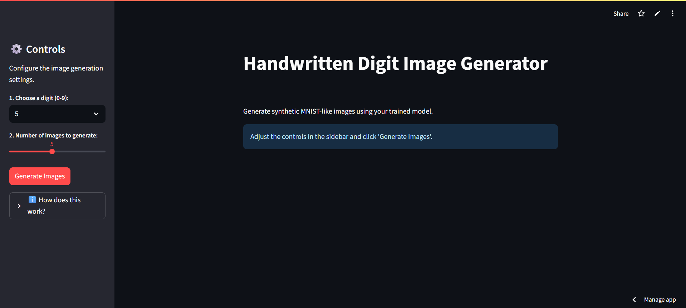
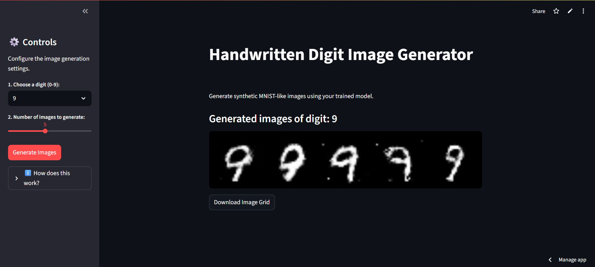
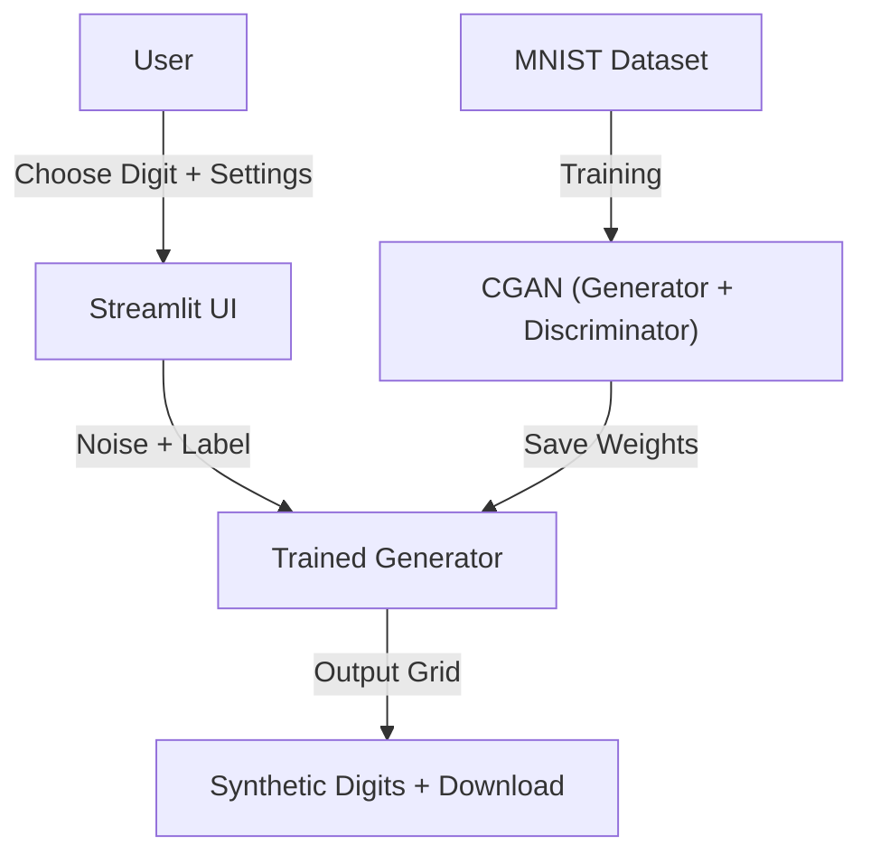

# AI Handwritten Digit Generator

This is an interactive web application that uses a **Conditional Generative Adversarial Network (cGAN)* to generate synthetic, realistic images of handwritten digits. Users can select a digit, choose how many images to create, and download the results

<p align="center">
  
  
  
  
</p>  

## Application Preview

### Streamlit App – Multiple Image Generation



### Generated Digits Grid



## Features

* **Conditional Digit Generation**: Pick any digit from **0–9** to generate.
* **Multiple Outputs**: Generate 1–10 images at once, displayed in a clean grid.
* **Download Option**: Save the generated grid as a `.png` file.
* **Sidebar Controls**: Adjust settings without leaving the main page.
* **Interactive Guide**: Learn how the model works via expandable instructions.
* **Colab Training**: Train the model in Google Colab and load it locally.

## Tech Stack

| Category   | Technology           |
| ---------- | -------------------- |
| Framework  | Python 3.9+, PyTorch |
| Dataset    | MNIST (torchvision)  |
| UI         | Streamlit            |
| Deployment | Local / Colab        |

## Architecture



## Local Setup & Installation

### Prerequisites

* Python 3.9 or higher
* pip or conda
* (Optional) Google Colab for training

### 1. Clone the Repository

```bash
git clone https://github.com/your-username/my_digit_generator.git
cd my_digit_generator
```

### 2. Create Virtual Environment

```bash
python -m venv venv
source venv/bin/activate   # On Windows: venv\Scripts\activate
```

### 3. Install Dependencies

```bash
pip install -r requirements.txt
```

### 4. Train the Model (Optional if you already have `cgan_generator.pth`)

```bash
python training_script.py
```

* Trained model will be saved at: `models/cgan_generator.pth`
* Training samples will appear in `images/`

### 5. Run the Streamlit App

```bash
streamlit run app.py
```

It will open in your browser at `http://localhost:8501`.

## Google Colab

* Upload `training_script.py` to Colab and train on MNIST.
* Download the trained weights `cgan_generator.pth`.
* Place them in the `models/` folder for local use.

## Example Results

| Input Label | Generated Grid                 |
| ----------- | ------------------------------ |
| **3**       |  |
| **7**       |  |

## Security Notes

* Keep `venv/`, `data/`, and large model checkpoints out of Git.
* Only commit the final `models/cgan_generator.pth`.
* Add sensitive paths to `.gitignore`.

## License

This project is under the MIT License. See the LICENSE file for details.
